<div align="center">
  <h1>
    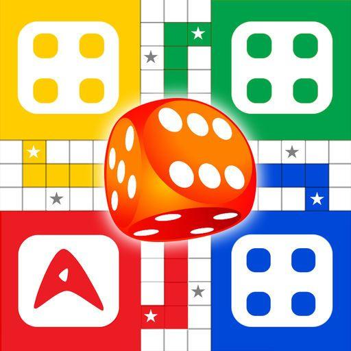<br/>
    Ludo Flutter - Modern Multiplayer Board Game
  </h1>
  <h3>A Feature-Rich Ludo Game with Beautiful UI, Sound Effects, and Multiple Game Modes</h3>
</div>

<p align="center">
    
    
    
</p>

## 📸 Banner
<p align="center">
    
</p>

## 📌 Overview

A beautifully designed Flutter Ludo game with modern UI, smooth animations, and multiple game modes. The app features both online and offline gameplay, sound effects, and a comprehensive player profile system.

## 🚀 Tech Stack

- **Flutter** (UI Framework)
- **Provider** (State Management)
- **Firebase** (Authentication & Database)
- **SharedPreferences** (Local Storage)
- **Custom Animations**
- **Material Design**
- **Audio Integration**

## 🔑 Key Features

- ✅ **Multiple Game Modes**: 2, 3, or 4 player options
- ✅ **Online & Offline Play**: Play with or without internet
- ✅ **Google Authentication**: Secure login system
- ✅ **Sound Effects**: Immersive gaming experience
- ✅ **Player Statistics**: Track your gaming progress
- ✅ **Modern UI**: Beautiful and responsive interface
- ✅ **Profile System**: Customizable player profiles
- ✅ **Settings**: Customizable game preferences

## 📸 Screenshots

### Onboarding Experience

<table border="1">
  <tr>
    <td align="center">
      
      <p><b>Welcome Screen</b></p>
    </td>
    <td align="center">
      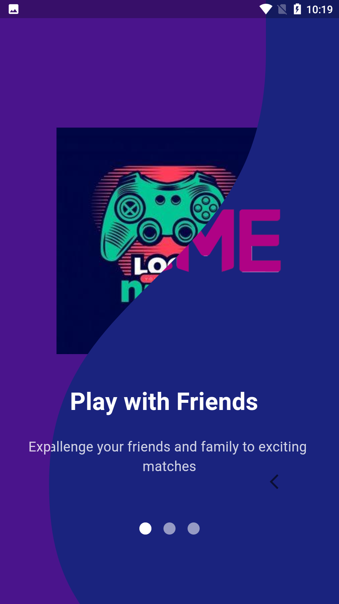
      <p><b>Introduction</b></p>
    </td>
    <td align="center">
      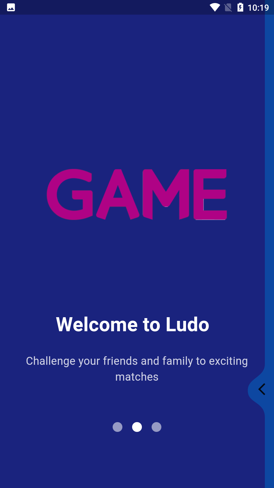
      <p><b>Features</b></p>
    </td>
  </tr>
  <tr>
    <td align="center">
      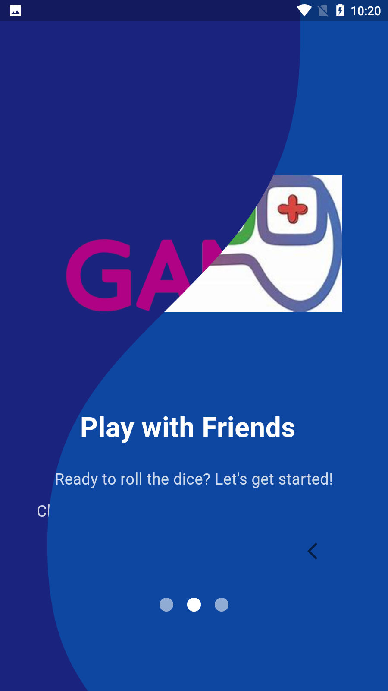
      <p><b>Game Modes</b></p>
    </td>
    <td align="center">
      
      <p><b>Multiplayer</b></p>
    </td>
    <td align="center">
      
      <p><b>Get Started</b></p>
    </td>
  </tr>
</table>

### Authentication & Login

<table border="1">
  <tr>
    <td align="center">
      
      <p><b>Login Screen</b></p>
    </td>
    <td align="center">
      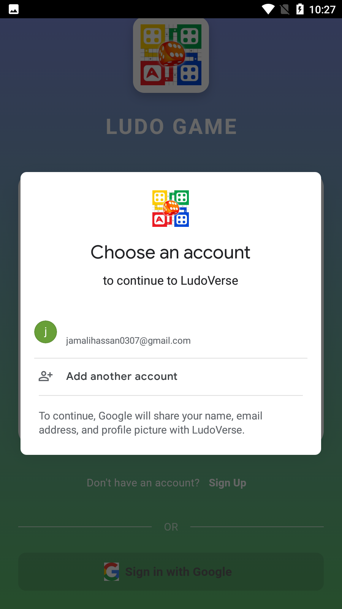
      <p><b>Google Sign In</b></p>
    </td>
    <td align="center">
      
      <p><b>Loading State</b></p>
    </td>
  </tr>
  <tr>
    <td align="center">
      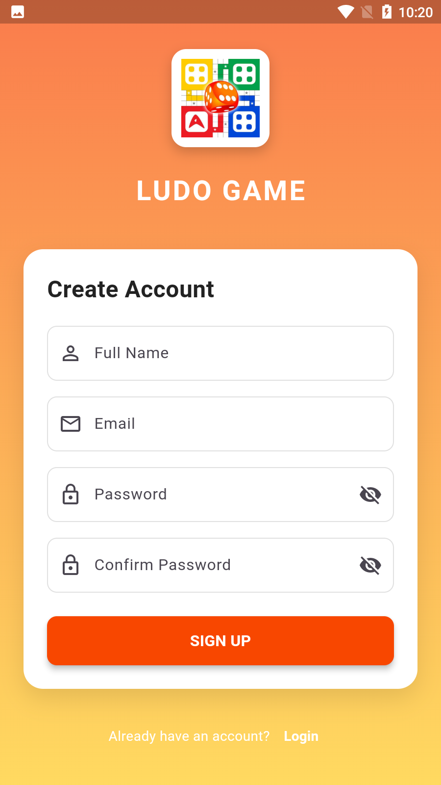
      <p><b>Sign Up</b></p>
    </td>
    <td align="center">
      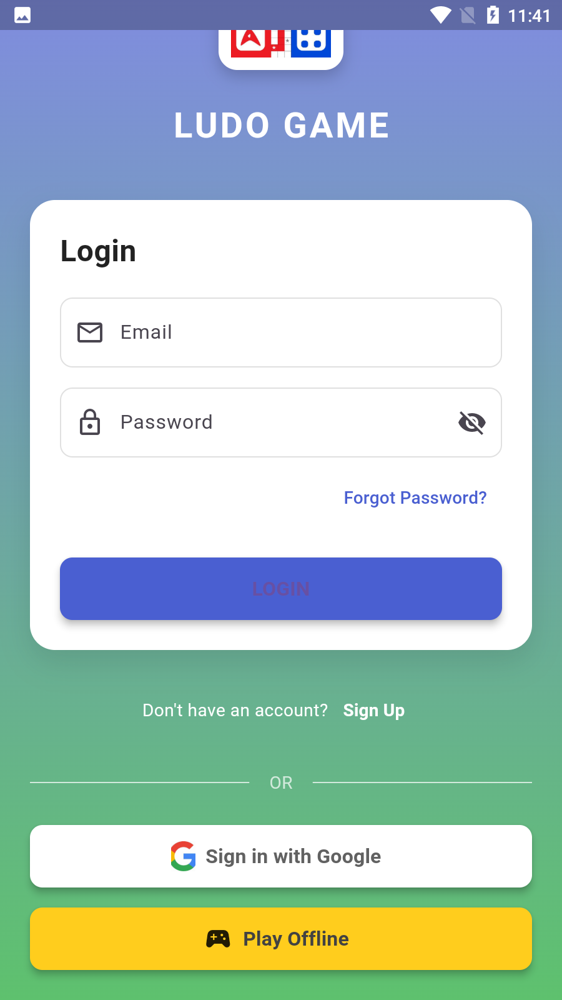
      <p><b>Offline Play</b></p>
    </td>
  </tr>
</table>

### Game Modes & Gameplay

<table border="1">
  <tr>
    <td align="center">
      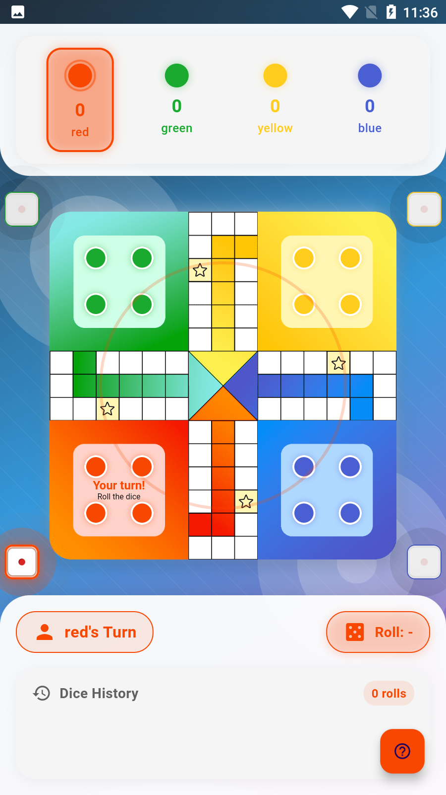
      <p><b>4 Player Mode</b></p>
    </td>
    <td align="center">
      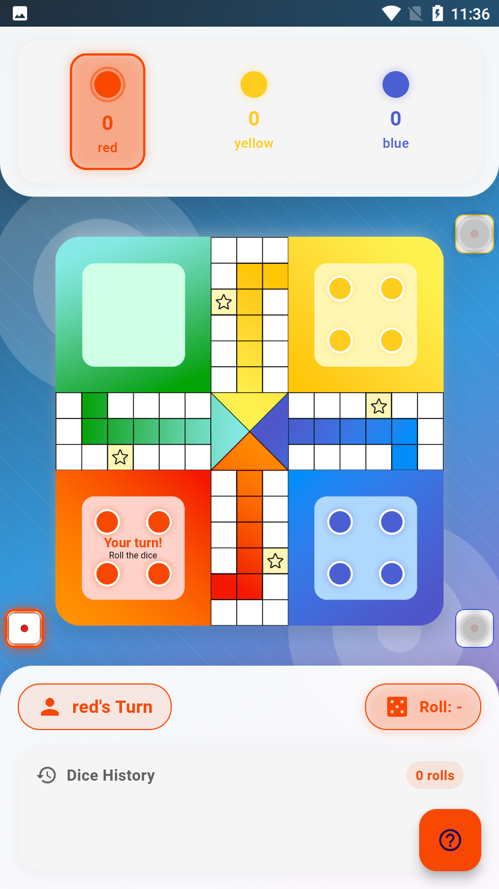
      <p><b>3 Player Mode</b></p>
    </td>
    <td align="center">
      
      <p><b>2 Player Mode</b></p>
    </td>
  </tr>
  <tr>
    <td align="center">
      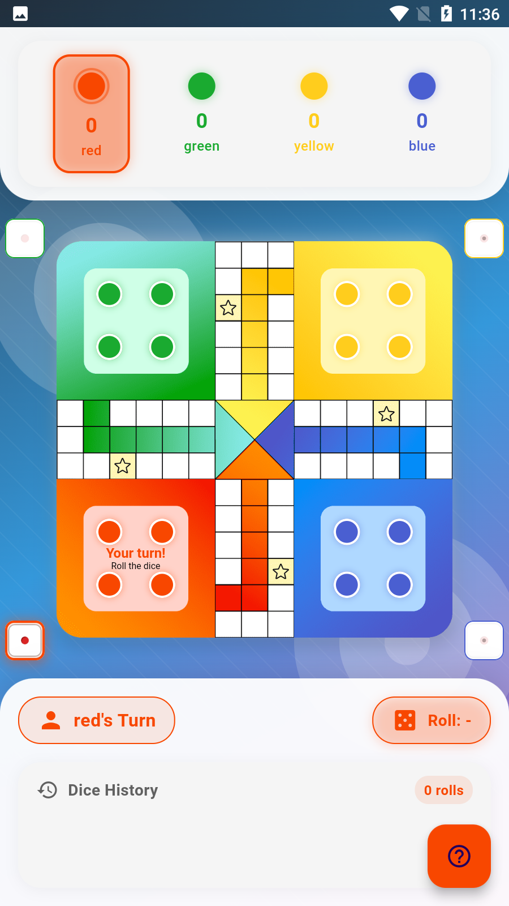
      <p><b>4 Player Gameplay</b></p>
    </td>
    <td align="center">
      
      <p><b>Exit Confirmation</b></p>
    </td>
  </tr>
</table>

### Game Features & Navigation

<table border="1">
  <tr>
    <td align="center">
      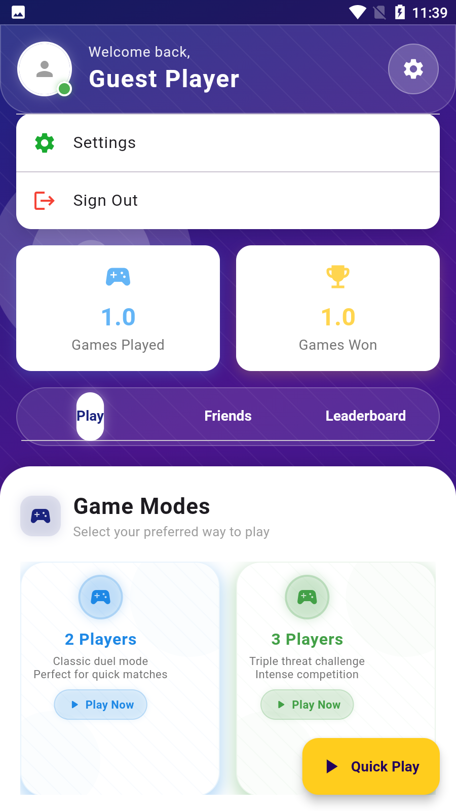
      <p><b>Home Screen</b></p>
    </td>
    <td align="center">
      
      <p><b>Game Selection</b></p>
    </td>
    <td align="center">
      
      <p><b>Friends List</b></p>
    </td>
  </tr>
  <tr>
    <td align="center">
      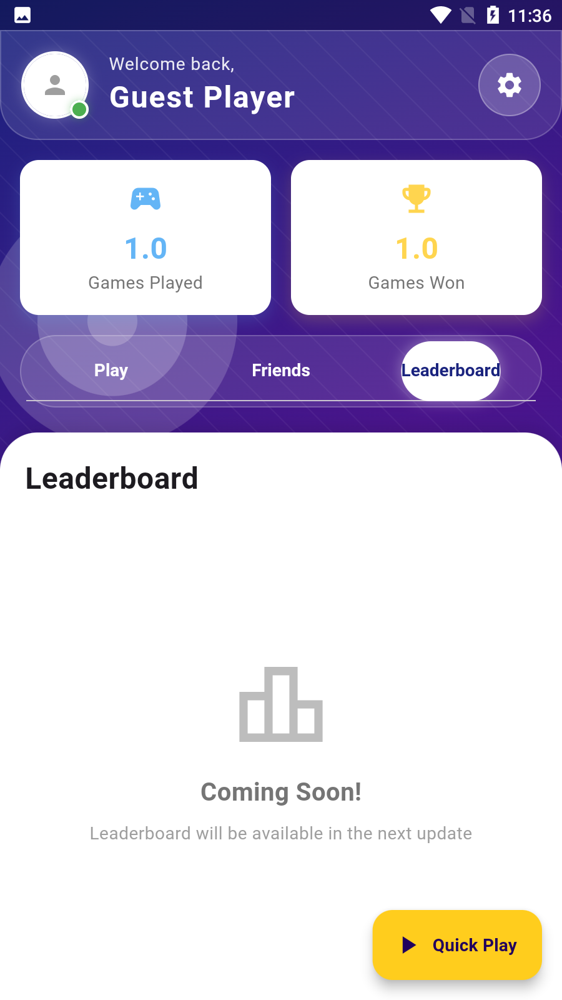
      <p><b>Leaderboard</b></p>
    </td>
    <td align="center">
      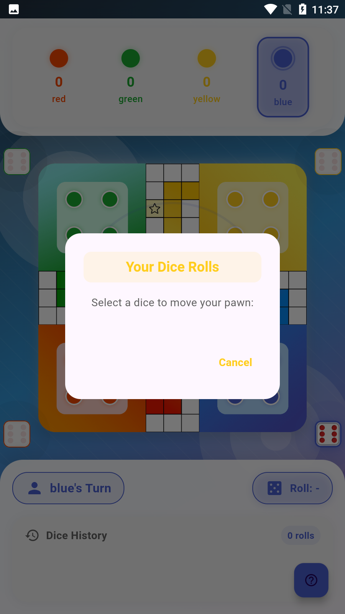
      <p><b>Move Selection</b></p>
    </td>
    <td align="center">
      
      <p><b>Move Options</b></p>
    </td>
  </tr>
</table>

### Settings & Configuration

<table border="1">
  <tr>
    <td align="center">
      
      <p><b>Settings Main</b></p>
    </td>
    <td align="center">
      
      <p><b>Audio Settings</b></p>
    </td>
    <td align="center">
      
      <p><b>Profile Settings</b></p>
    </td>
  </tr>
</table>

## 🎮 Game Features

### Sound Effects
- Dice rolling sounds
- Piece movement audio
- Victory/defeat sounds
- Background music options

### Game Modes
1. **2 Player Mode**: Quick head-to-head matches
2. **3 Player Mode**: Triple threat challenges
3. **4 Player Mode**: Full board experience
4. **Offline Mode**: Play without internet connection

## 📁 Project Structure

```
lib/
├── models/
│   ├── user_model.dart
│   └── offline_user.dart
├── providers/
│   └── user_provider.dart
├── screens/
│   ├── login_screen.dart
│   ├── home_page.dart
│   ├── settings_page.dart
│   └── profile_completion_page.dart
├── constants/
│   └── colors.dart
├── assets/
│   ├── sounds/
│   │   ├── move.wav
│   │   ├── roll_the_dice.mp3
│   │   └── laugh.mp3
│   └── images/
│       ├── board.png
│       └── thankyou.gif
└── main.dart
```

## 📱 Download APK

You can download the latest version of the app from:
[APK/app-armeabi-v7a-release.apk](APK/app-armeabi-v7a-release.apk)

## 🎵 Sound Attribution

The game includes the following sound effects:
- Move sound (`move.wav`)
- Dice rolling sound (`roll_the_dice.mp3`)
- Victory laugh sound (`laugh.mp3`)

## 🎲 Game Rules

1. Each player gets 4 pieces
2. Roll a 6 to start moving pieces
3. Land on an opponent's piece to send it back
4. Get all pieces to home to win
5. Special rules for safe spots and shortcuts

## 🔧 Settings & Customization

- Sound effects toggle
- Vibration settings
- Notification preferences
- Theme customization
- Player profile editing

## 🏆 Features Coming Soon

- Online multiplayer mode
- Global leaderboards
- Friend system
- Chat functionality
- Custom board themes
- Achievement system

## 🎯 How to Play

1. Choose game mode (2, 3, or 4 players)
2. Select online or offline play
3. Roll dice by tapping
4. Move pieces by selecting them
5. Follow standard Ludo rules
6. Get all pieces home to win!

